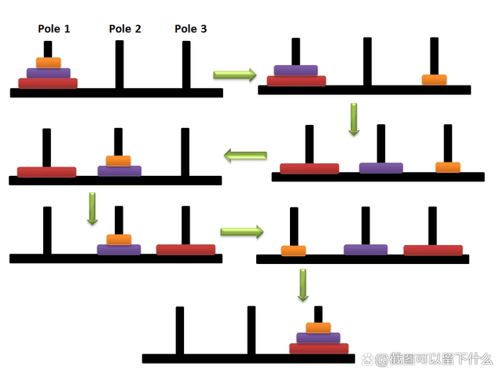

# 递归——汉诺塔

[参考链接](https://baijiahao.baidu.com/s?id=1726173466527059448&wfr=spider&for=pc)
[原文链接](https://blog.csdn.net/reqingfendou/article/details/123474981)

### 首先，何为汉诺塔问题？

如图



> 汉诺塔有个口诀叫做：单左双右，先小后大，一步两步循环往复。以下图所示举例 A 表示第一个柱子 B 表示第二个珠子 C 表示第三个柱子 -->表示盘的移动方向。

### js 解法

#### 思路

- 定义一个函数：hannuo(a, b, c, n)；此函数的意义是将 a 柱上的模块借助 b 柱转移到 c 柱上
- 找到递归出口，即当 n=1 时，就转移 a 柱上的第 n 层板块到 c 柱上，也就是 a 柱上的最大的那一个模块 n，代码语句为：document.write(`请把${a}移到${c}<br>`)
- 要解决第 n 块模块，就必然要先解决第 n-1 块模块，所以，就可以套用该函数，来解决这第 n-1 块的转移，且这第 n-1 块模块要先转移到 b 柱上，再输出 document.write(`请把${a}移到${c}<br>`)，再将第 n-1 块从 b 柱上转移到 c 柱上，以此类推即可。

#### 代码

```js
function hannuo(a, b, c, n) {
  if (n == 1) {
    document.write(`请把${a}移到${c}<br>`);
  } else {
    hannuo(a, c, b, n - 1);

    document.write(`请把${a}移到${c}<br>`);
  }
}

hannuo("a", "b", "c", 4);
```

[汉诺塔玩法介绍-视频](https://haokan.baidu.com/v?pd=wisenatural&vid=3741179232668217031)
