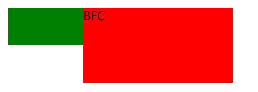
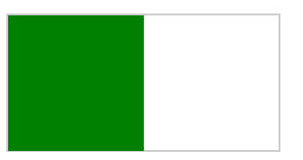
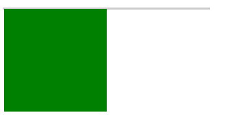
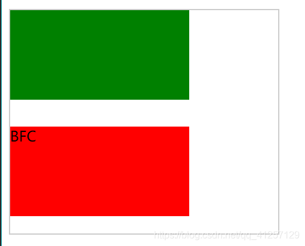
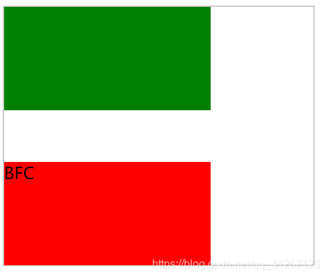

# BFC

### BFC到底是什么？
简单的来说：BFC就是一个css的一个布局概念，是一个独立的区域，是一个环境。

### 文档流
说BFC之前先说说文档流，文档流分为：`浮动流`、`定位流`、普通的`标准流`，而普通标准流其实就是BFC中的`FC`。

- FC：formatting context的英文缩写，翻译过来就是`格式化上下文`，它是页面中的`一块渲染区域`，有一套渲染规则，`决定了其子元素如何布局，以及与元素之间的关系和作用`。

- 常见的FC：BFC(块级格式化上下文)、IFC(行级格式上下文)、GFC(网络布局格式上下文)、和FFC(自适应格式上下文)。

### BFC的定义
BFC（Block formatting context ）“块级格式上下文”。 是用于`布局块级盒子的一块渲染区域`。并且与这个区域的外部毫无关系。

### 触发BFC的条件
满足下列条件之一就可以触发BFC

- 根元素，即html元素
- float的值不为none
- overflow的值不为visible
- display的值为inline-block、inline-flex、flex、flow-root、table-caption、table-cell。
- position的值为absolute或者fixed

### BFC的作用
BFC是页面独立的一个容器，与外界的毫无关系。
与不同容器的区别是：

##### 1 可以阻止元素被浮动的元素覆盖（可做两栏布局自适应）
绿色盒子浮动遮挡了红色盒子


触发红色盒子的BFC，可防止被绿色盒子遮挡



```html
  <style>
        *{
            padding:0;
            margin :0;
        }
        .box {
            width: 400px;
            height: 100px;
            margin: 0  auto;
        }
        .green {
            width: 100px;
            height: 50px;
            float: left;
            background-color: green;
        }
        .red {
            width: 200px;
            height: 100px;
            /* float: left; */
            /* display: inline-block; */
            /* display: table-cell; */
            /* overflow: hidden; */
            /* position: absolute; */
            /* position: fixed; */
            background-color: red;
        }
    </style>
</head>
<body>
    <div class="box">
        <div class="green"></div>
        <div class="red">BFC</div>
    </div>
</body>
```


##### 2 可以包含浮动的元素—清除浮动
> 说明：我们知道当浮动的盒子的父元素没有高度时，会出现高度塌陷现象。

绿盒子设置浮动前，父盒子被撑开高度：



绿盒子设置浮动后，父盒子高度塌陷：



父盒子触发BFC可以解决这个问题。

```html
<style>
        .box {
            width: 200px;
            border: 1px solid #ccc;
            overflow：hidden；
        }
        .son {
            width: 100px;
            height: 100px;
            background-color: green;
            float: left;
        }
    </style>
</head>
<body>
    <div class="box">
        <div class="son"></div>
    </div>
</body>
```

##### 3 解决同一个BFC区域的垂直方向margin塌陷的问题
属于同一个BFC的两个相邻的box的margin会重叠，以大的为主。要想解决这个问题，可以将两个盒子分为不同的BFC中。

在同一个BFC中时：



分为两个不同的BFC之后：



```html
    <style>
        .green {
            width: 200px;
            height: 100px;
            margin-bottom: 20px;
            background-color: green;
        }
        .red {
            width: 200px;
            height: 100px;
            margin-top: 30px;
            background-color: red;
        }
        .box {
            overflow: hidden;

        } 
        .main {
            width: 300px;
            height: 250px;
            border: 1px solid #ccc;
        }
    </style>
</head>
<body>
        <div class="main">
            <div class="green"></div>
            <div class="box">
                <div class="red">BFC</div>
            </div>
        </div>   
</body>
```