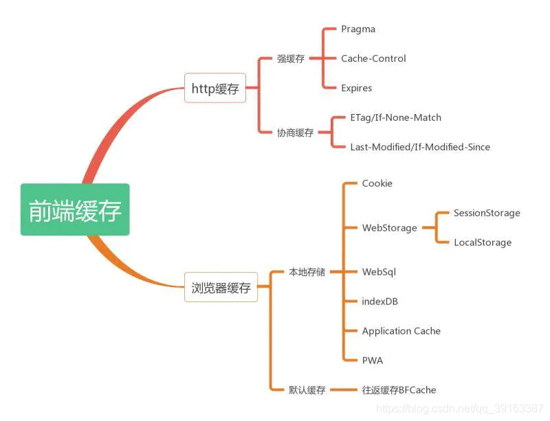

# HTTP缓存

### 前端缓存
前端缓存可分为两大类：http缓存和浏览器缓存。今天重点讲的是http缓存，所以关于浏览器缓存大家自行去查阅。下面这张图是前端缓存的一个大致知识点：
- 

HTTP 缓存策略分为两种： 强缓存 和 协商缓存 ，这两种缓存策略都是服务端设置 HTTP Header 来实现的

### 强缓存
强缓存的意思很简单，直接从浏览器缓存过的本地进行读取，不会去请求服务器。例如请求一个图片，当缓存后，第二次访问，直接从本地去拿，不会再去请求这个资源，可以节省服务器资源。可以通过三种方式来设置强缓存

Expires：服务端在响应头中设置一个 GMT 格式的到期时间。客户端的本地时间小于响应头的 Expires 时间，那么会从本地进行读取，不会去请求服务器。如果超过了，那么就去请求服务器去获取最新资源。但是就是因为根据本地时间进行判断，本地时间可以随便修改，所以这种缓存机制有漏洞，会与服务端时间有偏差，为了解决这个问题，就出现了下面的 Cache-contorl
Cache-control：他和Expires不一样，Expires是直接设置一个时间戳就行了，而Cache-control可以设置下面这几种属性：

max-age：这个用于设置一个滑动时间，例如设置 max-age=30 表示客户端时间向后滑动30秒，在这30秒内都是强缓存，不会去请求服务器
s-maxage：这个和上面的一样，只不过这个设置的是代理服务器的缓存时间
privte：这个表示缓存只能被客户端的浏览器缓存，不能被代理服务器缓存
public：这个表示缓存既可以被浏览器缓存，也可以被代理服务器缓存
no-store：这个属性表示不缓存，在任何情况下，都是与服务器进行最新的交互
no-cache：这个并非不缓存的意思，这个表示强制进行协商缓存，会在下面描述


### 协商缓存
协商缓存表示在使用本地的缓存之前，会先向服务器发一个请求，与服务器协商当前浏览器的缓存是否已经过期了，如果没过期，那么就使用本地的资源，如果过期了就去请求最新资源。协商缓存主要是解决强缓存资源不能及时更新的问题，协商缓存服务端可以通过2种设置来实现：

##### 第一种：last-modified 配合 If-Modified-Since

例如，客户端请求一个 03.jpg，服务端接收到这个请求后，会读取这个文件的最后修改时间，然后设置到响应头中，设置的参数就是 last-modified，参数值是文件最后修改的时间戳。客户端第二次请求 03.jpg 这个文件的时候，会带上一个 If-Modified-Since 参数，服务端能拿到这个参数与last-modified进行比对，如果一致，那么就返回304状态，否则就去请求最新的文件，使用nodejs实现这个代码：（注意协商缓存需要设置Cache-Control为no-cache，表示设置成协商缓存）

```js
// 判断客户端请求的是03这个图片
if(pathname === '/img/03.jpg') {
    // 读取 03 图片的最后修改时间
    const { mtime } = fs.statSync("./img/03.jpg")
    // 判断客户端发送过来的if-modified-since是否与mtime一致，如果一致就直接返回304
    if(req.headers['if-modified-since'] === mtime.toUTCString()) {
        res.statusCode = 304
        res.end()
    } else {
        // 如果不一致，那么就请求最新的资源返回给客户端
        const data = fs.readFileSync("./img/03.jpg")
        // 这2句代码是设置协商缓存
        res.setHeader("last-modified", mtime.toUTCString())
        res.setHeader("Cache-Control", "no-cache")
        res.end(data)
    }
}
```
上面的 last-modified 配合 If-Modified-Since在使用时有些弊端，例如将03.jpg修改成04.jpg，再改回03.jpg。此时这个文件其实是没有变化的，但是最后修改时间更改了，因此客户端就需要重新请求，因此就出现了下面的第二种使用Etag的方式


##### 第二种：Etag 配合 If-None-Match
Etag实现的方式服务端是为文件生成一个指纹，类似于MD5字符串。接着响应头中塞进 Etag 参数，参数的值就是计算出的字符串，客户端接收到后，第二次请求会带上一个 If-None-Match 的参数，接着服务端和上面第一种方式一样进行比对，nodejs的实现代码如下：

```js
// 引入etag模块
const etag = reqiure("etag")
if(pathname === '/img/03.jpg') {
    const data = fs.readFileSync("./img/03.jpg")
    // 获取生成的etag字符串
    const etag = etag(data)
    // 判断客户端发送的 If-None-Match 与服务端是否一致
    if(req.headers['if-none-match'] === etag) {
        res.statusCode = 304
        res.end()
    } else {
        // 如果不一致，那么就请求最新的资源返回给客户端
        const data = fs.readFileSync("./img/03.jpg")
        // 这2句代码是设置协商缓存
        res.setHeader("etag", etag)
        res.setHeader("Cache-Control", "no-cache")
        res.end(data)
    }
}
```

###### 搭配 : 浏览器从输入url到页面发生了什么