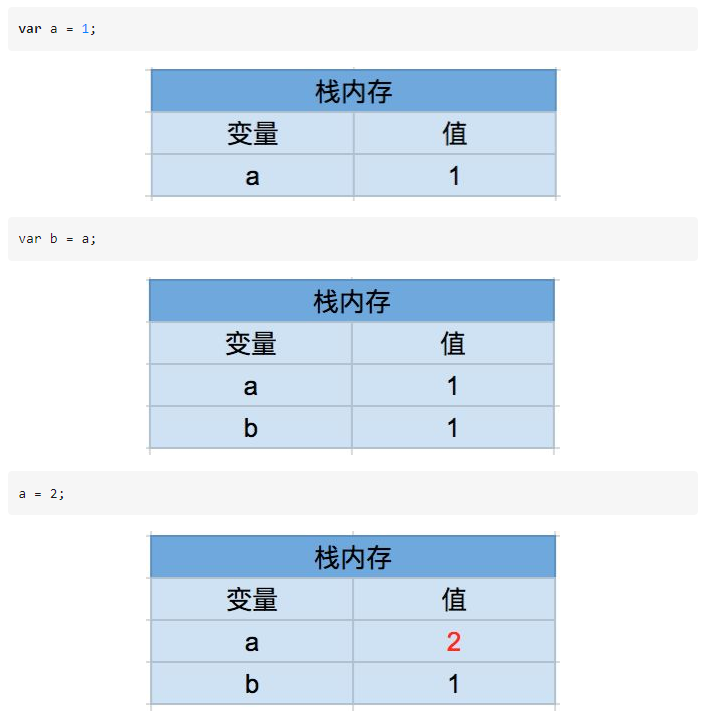
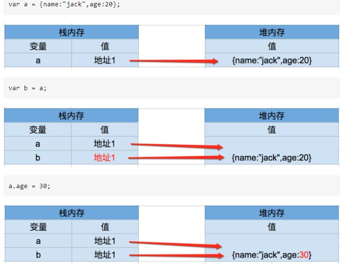
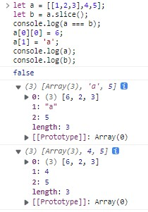
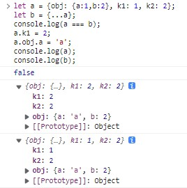
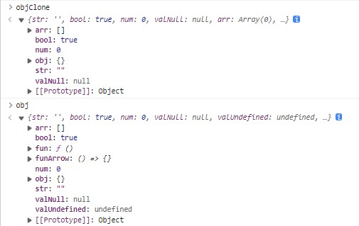
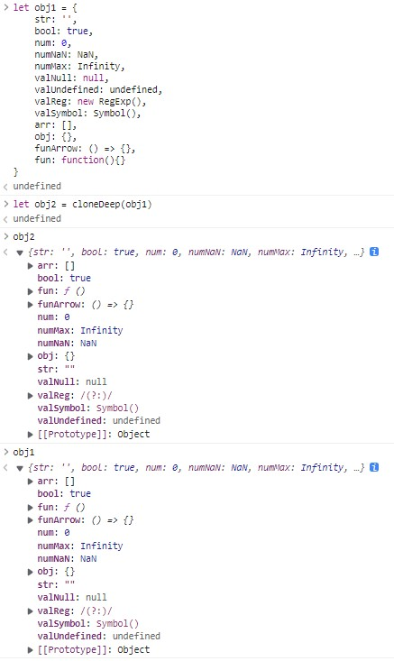

# 深拷贝和浅拷贝

如何区分深拷贝与浅拷贝，简单点来说，就是假设B复制了A，当修改A时，看B是否会发生变化，如果B也跟着变了，说明这是浅拷贝，拿人手短，如果B没变，那就是深拷贝，自食其力。

### 栈堆、基本数据类型、引用数据类型

栈堆：存放数据的地方

基本数据类型：`number`,`string`,`boolean`,`null`,`undefined`.

引用数据类型(`Object`类)有常规名值对的`无序对象`{a:1}，`数组`，以及`函数`等。


### 浅拷贝
```js
let a= [0,1,2,3,4], b=a;
console.log(a===b); // true
a[0] = 1
console.log(a,b) // (5) [1, 1, 2, 3, 4] (5) [1, 1, 2, 3, 4]
```

### 深拷贝
```js
const simpleClone = param => JSON.parse(JSON.stringify(param));

let a = [1,2,3]; b = simpleClone(a);
console.log(a === b); // false
a[2] = 'a';
console.log(a,b) // (3) [1, 2, 'a'] (3) [1, 2, 3]
```

### 引用类型和基本类型栈内存储
- 基础类型
- 
- 引用类型
- 

> 当引用类型参与判断时，其实是判断内存地址是否相同（是否是一个地址）

### 一些常见的例子

##### Array的slice和concat方法
slice拷贝
```js
let a = [1,2,3];
let b = a.slice(); //slice
console.log(b === a); // false
a[0] = 4;
console.log(a); // (3) [4, 2, 3]
console.log(b); // (3) [1, 2, 3]
```
concat拷贝
```js
let a = [1,2,3];
let b = a.concat();  //concat
console.log(b === a); // false
a[0] = 4;
console.log(a); // (3) [4, 2, 3]
console.log(b); // (3) [1, 2, 3]
```
看到结果，如果你觉得，这两个方法是深拷贝，那就恭喜你跳进了坑里！

看下面的例子
```js
let a = [[1,2,3],4,5];
let b = a.slice();
console.log(a === b); // false
a[0][0] = 6;
a[1] = 'a';
console.log(a);
console.log(b);
```


可以看到 `slice` 和 `contact` 对于`第一层是深拷贝`，但对于多层的时候，是复制的`引用`，所以是`浅拷贝`

##### 展开运算符
```js
let a = {obj: {a:1,b:2}, k1: 1, k2: 2};
let b = {...a};
console.log(a === b); // false
a.k1 = 2;
a.obj.a = 'a';
console.log(a);
console.log(b);
```


和 `slice` 、 `contact` 类似，展开运算符也是`一层深拷贝`，多层为引用关系，也是`浅拷贝`
> 对数组使用展开运算符相同

##### Object.assign
先说结论：`一层深拷贝`，多层为引用关系，也是`浅拷贝`

使用babel将ES6转换为ES5后，获取了Object.assign方法的ES5版本：

```js
rowData=Object.assign(rowData,obj);

//ES5版本代码如下:

var _extends = Object.assign || function (target) {
    for (var i = 1; i < arguments.length; i++) {
        var source = arguments[i];
        //遍历一个对象的自身和继承来的属性，
        //常常配合hasOwnProperty筛选出对象自身的属性
        for (var key in source) {  
            //使用call方法,避免原型对象扩展带来的干扰
            if (Object.prototype.hasOwnProperty.call(source, key)) {
                target[key] = source[key];
            }
        }
    }
    return target;
};

rowData = _extends(rowData, obj);
```
一目了然，这也就解释了，为什么 `Object.assign` 是浅拷贝，因为只处理第一层关系

### 真正的深拷贝
大家都知道使用 `JSON序列化` 实现的 `深拷贝` 是不完整的
- 如果obj里面有时间对象，则JSON.stringify后再JSON.parse的结果，时间将只是字符串的形式。而不是时间对象；
- 如果obj里有RegExp、Error对象，则序列化的结果将只得到空对象；
- 如果obj里有function，Symbol 类型，undefined，则序列化的结果会把函数或 undefined丢失；
- 如果obj里有NaN、Infinity和-Infinity，则序列化的结果会变成null 
- JSON.stringify()只能序列化对象的可枚举的自有属性，例如 如果obj中的对象是有构造函数生成的， 则使用JSON.parse(JSON.stringify(obj))深拷贝后，会丢弃对象的constructor；

```js
let obj1 = {
    str: '',
    bool: true,
    num: 0,
    numNaN: NaN,
    numMax: Infinity,
    valNull: null,
    valUndefined: undefined,
    valReg: new RegExp(),
    valSymbol: Symbol(),
    arr: [],
    obj: {},
    funArrow: () => {},
    fun: function(){}
}
const simpleClone = param => JSON.parse(JSON.stringify(param));
let objClone = simpleClone(obj1);
```



所以真正的深拷贝就会用到 `递归` 和 `类型判断`

```js
function cloneDeep(obj) {
    let newObj = Array.isArray(obj) ? [] : {}
    if (obj && typeof obj === "object") {
        for (let key in obj) {
            if (obj.hasOwnProperty(key)) {
                if (obj[key] === null) {
                    newObj[key] = null; // null为 object
                } else if (obj[key] instanceof RegExp) {
                    newObj[key] = new RegExp(obj[key]); // reg 也是object
                } else {
                    newObj[key] = (obj && typeof obj[key] === 'object') ? cloneDeep(obj[key]) : obj[key];
                }
            }
        }
    } 
    return newObj
}
```



:::tip
虽然说一些特殊类型 json序列化 会丢失，但其实也能满足日常的简单使用，如果真的涉及特殊类 日期 reg Error symbol function

不如考虑用其他方式，通过构造函数创建，class...

另外，关于 symbol ，本身就是一个 唯一 同时又是一个单独类型，目前开发暂时还没有用到过，这里就不再多做处理了，主要还是 `null`

:::