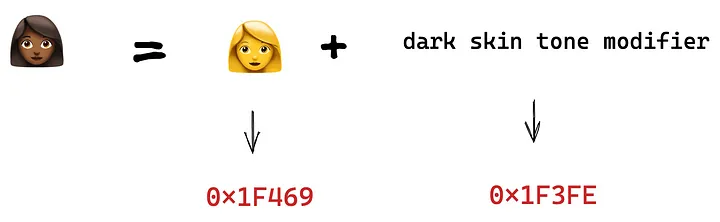

# 为什么 […‘👩‍❤️‍💋‍👨’] 在 JavaScript 中返回 [‘👩’, ‘‍’, ‘❤’, ‘️’, ‘‍’, ‘💋’, ‘‍’, ‘👨’]？

[原文链接: medium](https://medium.com/frontend-canteen/why-%EF%B8%8F-returns-%EF%B8%8F-in-javascript-7b890e3a13b2)

[原文作者: bytefish](https://medium.com/@bytefish?source=---two_column_layout_sidebar----------------------------------)

> 从编程的角度你应该知道的关于表情符号的事情。

有一个女人 👩 和一个男人 👨，他们相爱 ❤ 并亲吻 💋，所以他们是一对情侣 👩‍❤️‍💋‍👨。

有一个人 👨🏼 喜欢计算机 💻 科学，所以他成为了一名程序员 👨🏼‍💻。

有一个女孩 👩🏾，她喜欢画画 🎨，她成为了一名艺术家 👩🏾‍🎨。

关于表情符号`emoji`的一个有趣的事情是你可以将一些单一的表情符号组合成一个整体。

```js
["👩", "‍", "❤", "️", "‍", "💋", "‍", "👨"]
  .join("") // 👩‍❤️‍💋‍👨

  [("👨", "🏼", "‍", "💻")].join("") // 👨🏼‍💻

  [("👩", "🏾", "‍", "🎨")].join(""); // 👩🏾‍🎨
```


你可以将一个复杂的表情符号拆分成简单的表情符号，如标题所述：

```js
[...'👩‍❤️‍💋‍👨']
[...'👨🏼‍💻']
[...'👩🏾‍🎨']
```


在本文中，我们将讨论一些与表情符号`emoji`相关的话题。

### 什么是表情符号`emoji`？

表情符号是最初与日本手机使用相关的“图片字符”，但现在在全球范围内流行。 emoji 这个词来自日语絵（e≅ 图片）+文字（moji≅ 书面字符）。

表情符号通常是象形文字——诸如面孔、天气、车辆和建筑物、食物和饮料、动物和植物等事物的图像——或代表情绪、感受或活动的图标。大多数表情符号字符都以彩色呈现。

### 从编程的角度来看，表情符号是什么？

表情符号也是一个字符串。它不是新的数据类型，它们只是一个字符串。


而且，我们知道在计算机科学中，每个字符都对应一个 Unicode 代码。这是一个例子：


您可以从他们的[官方网站](https://home.unicode.org/)获得完整的 Unicode 列表。

### Emoji Modifier - Emoji 修饰符

同时我们也知道 Unicode 码位是有限的，我们不可能给所有的 emoji 都分配一个独立的 Unicode 编码。所以一些表情符号是由基本表情符号加上表情符号修饰符组成的，例如：




### Emoji ZWJ Sequences - 表情符号 ZWJ 序列

即使使用表情符号修饰符，这也是不够的。比如我们想用 emoji 来表达情侣，应该怎么办？

一种方案是直接在 Unicode 中添加代表情侣的符号，但这种方案占用的 Unicode 资源太多。为了方便，人们发明了 Emoji ZWJ(ZERO WIDTH JOINER) Sequences，它允许我们将不同的 emoji 组合在一起。

比如男人加电脑就是男程序员，女人加电脑就是女程序员。


在拼接表情符号的时候，我们需要用到一个特殊的连接器，即 U+200D ZERO WIDTH JOINER (ZWJ)。

```js
"👨" + "💻"; // can not join
"👨" + "\u200D" + "💻"; // ok
"👩" + "\u200D" + "💻"; // ok
"👨🏼" + "\u200D" + "💻"; // ok
```


所以我们可以知道一件事：许多表情符号不是单个字符，而是其他表情符号和连接符拼接在一起的。

如果你想看到所有的表情符号序列，你可以看这里：

[推荐的表情符号 ZWJ 序列，v14.0](http://www.unicode.org/emoji/charts/emoji-zwj-sequences.html)


### Spread syntax (…) 扩展运算符 (...)

扩展语法 ( ... ) 允许在需要零个或多个参数（用于函数调用）或元素（用于数组文字）的地方扩展数组表达式或字符串等可迭代对象，或者扩展对象表达式期望零个或多个键值对（对于对象文字）的地方。

```js
[..."bytefish"];
```


### Back to the Title 回到标题

现在我们来讨论一下标题中的问题。

👩‍❤️‍💋‍👨 也是一个表情符号序列，由女人 👩、男人 👨、爱 ❤、嘴巴 💋 组成。 （毕竟，接吻需要用到嘴巴。）

其组成结构如下：


当然，你可能已经注意到这个表情符号中还有一个 U+FEOF 字符。这实际上是一个特殊的字符串：

> In Unicode the value `U+FE0F` is called a variation selector. The **variation selector** in the case of emoji is to tell the system rendering the character how it should treat the value. That is, whether it should be treated as text, or as an image that could have additional properties, like color or animation.
>
> 在 Unicode 中，值 `U+FE0F` 称为 **变体选择器** 。表情符号的变体选择器是告诉渲染角色的系统它应该如何处理这个值。也就是说，它应该被视为文本，还是可以具有其他属性（如颜色或动画）的图像。
>
> For emoji, there are two different variation selectors that can be applied, `U+FE0E` and `U+FE0F`. `U+FE0E` specifies that the emoji should be presented as text. `U+FE0F` specifies that it should be presented as an image, with color and possible animation.
>
> 对于表情符号，可以应用两种不同的变体选择器， `U+FE0E` 和 `U+FE0F` 。 `U+FE0E` 指定表情符号应显示为文本。 `U+FE0F` 指定它应该作为图像呈现，带有颜色和可能的动画。
>
> Without the variation selector, the character still renders fine, (just look at the page source at this character: ☁) but there’s no additional information about the presentation.
>
> 没有变体选择器，角色仍然可以很好地呈现，（只要看看这个角色的页面源代码：☁）但是没有关于演示的额外信息。

[表情符号中的 u'\ufe0f' 是什么意思？删了是不是也一样？](https://stackoverflow.com/questions/38100329/what-does-u-ufe0f-in-an-emoji-mean-is-it-the-same-if-i-delete-it)

这时候，当我们在这个 emoji 上使用展开运算符时，这个 emoji 就会被分解成 8 个独立的 Unicode 字符，其中 4 个也是 emoji，最后就像我们的标题所代表的那样。

标题中的内容已经解释过了，[作者](https://medium.com/@bytefish?source=---two_column_layout_sidebar----------------------------------)又补充了几点。

### 如何输入和打印表情符号？

与普通的字母和数字不同，键盘上没有对应表情符号的按键。所以你不能直接通过键盘输入表情符号。如果现在你想输入这四个表情符号，你会怎么做？


> （假设您已经知道他们的 Unicode 代码。）

你可以先自己试试。


在 **JavaScript** 中，我们可以通过 `String.fromCodePoint` 将 Unicode 转换为字符。静态 `String.fromCodePoint()` 方法返回使用指定代码点序列创建的字符串。

```js
String.fromCodePoint("0x1F60F");
String.fromCodePoint("0x1F612");
String.fromCodePoint("0x1F644");
String.fromCodePoint("0x1F62C");
```


在控制台打印出来后，我们就可以复制粘贴到其他地方了。 😏😒🙄😬

此外，对于表情符号序列：

```js
String.fromCodePoint("0x1F468", "0x1F3FC", "0x200D", "0x1F4BB");
String.fromCodePoint("0x1F469", "0x1F3FE", "0x200D", "0x1F3A8");
```


### Unicode 中有多少个表情符号？

Unicode 中有 1853 个表情符号，您可以从此链接获取完整的表情符号列表：

[Full Emoji List, v14.0 完整的表情符号列表，v14.0](https://unicode.org/emoji/charts/full-emoji-list.html)

### 表情符号的不同表示

但您还应该注意到一件事：相同的表情符号在不同的操作系统/应用程序中可能有不同的表示。

例如，一张笑脸（ `U+1F600` ）在浏览器、Apple、Facebook 中有不同的样式：


### Emoji Challenge

下面每组表情符号代表一本名著，你猜对了吗？


