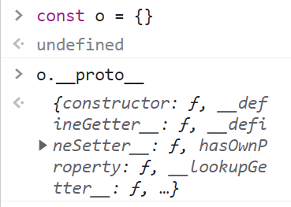
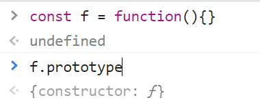
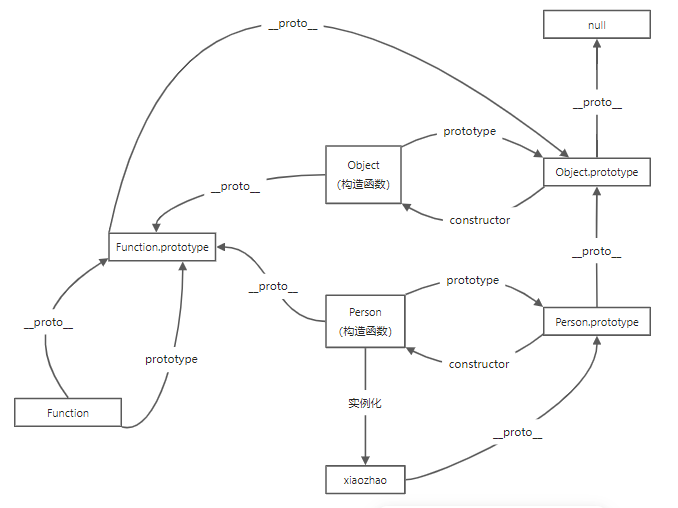
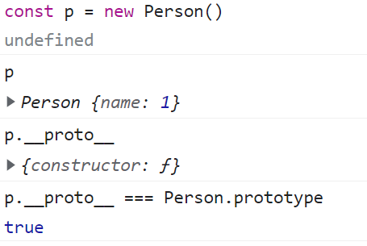
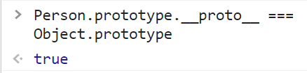
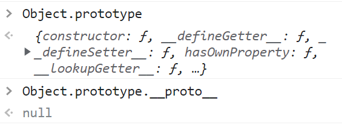
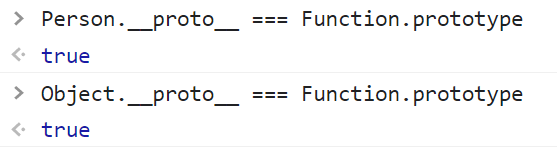
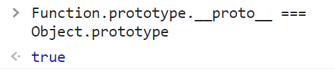

# js原型与原型链

彻底理解原型与原型链，搭配 `核心示例图理解`
### 前提条件
- 只要是对象，就会存在 `__proto__`
- 只要是函数，就会有 `prototype`
- 
- 
### 核心示例图

### 开始操作
- 以 `Person` 构造函数为例开始
- 通过 `new Person()` 获得到 `person` 对象
- 对象就存在 `__proto__`，指向的就是 `Person.prototype`
- 
- 同时我们发现，`p.__proto__` 和 `Person.prototype` 不但相等，还是一个对象 `{}`
- 既然是对象，就又会存在 `__proto__`，但此时，这个对象指向的就是 `Object.prototype`了
- 
- 然后 `Object.prototype` 和 `Object` 的关系，和Person是类似的，可以看图理解，这里就不再重复了
- 然后打印 `Object.prototype` 发现，还是一个对象，那么就还有 `__proto__`， 只不过此时，获得到的是`null`，这就是平常说的，`js在寻找属性的时候，会一直向上找，直到找到null`
- 
- 此时，object类型的解释完毕

### 另一条线 Function
- 回到 `Person` 和 `Object` 构造函数
- 函数是如何创建的，一定是通过 `Function` 获得到的，他们都是 `Function` 的实例
- 实例的 `__pro__` 指向 构造的 `prototype`
- 
- 然后 `Function` 和 `Function.prototype` 的关系还是和上面类似，不多解释了
- 但是 `Function.prototype` 又是一个对象，所以他的 `__proto__` 又会指向到 `Object.protytype`
- 至此 `Function` 和 `Object` 的关系闭环
- 
- Over~
